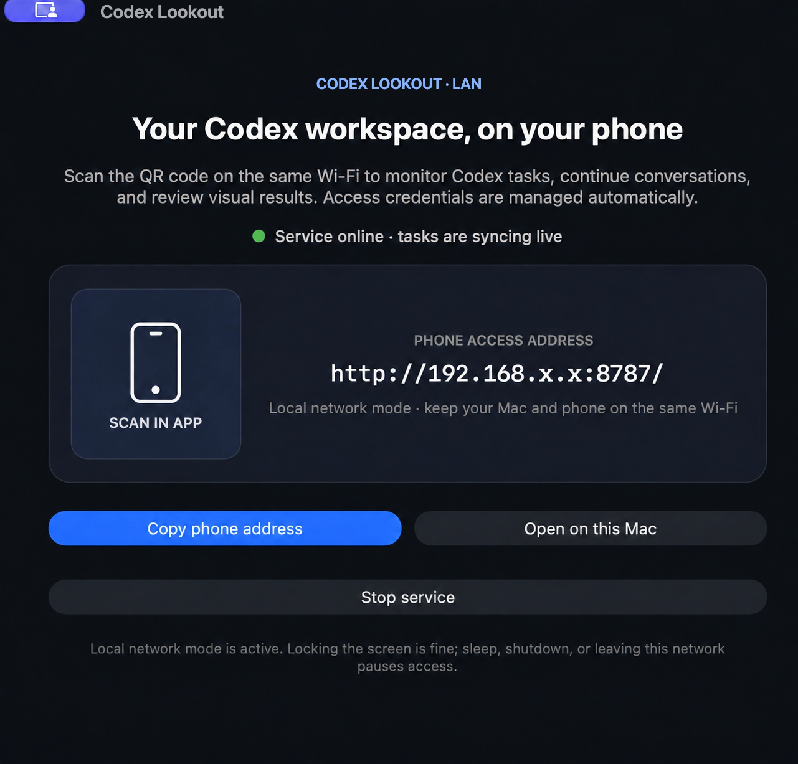
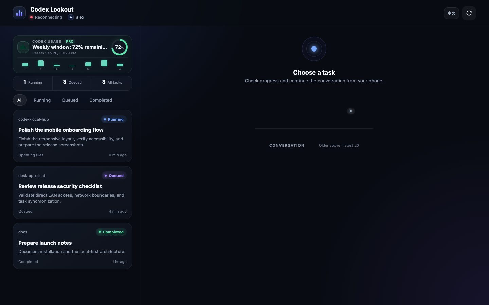
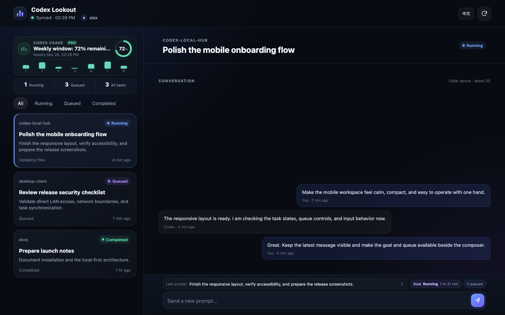
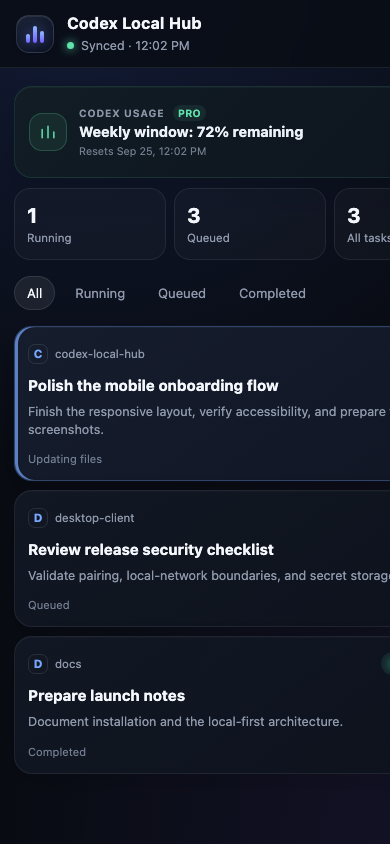
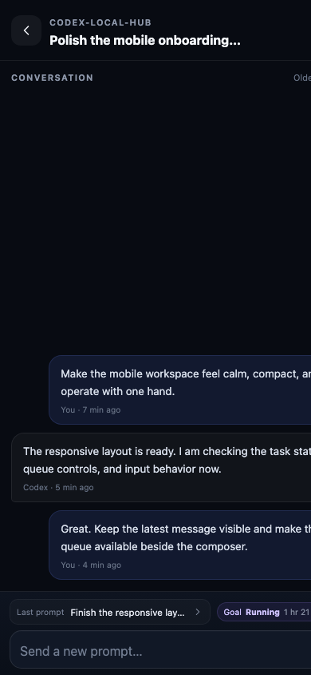
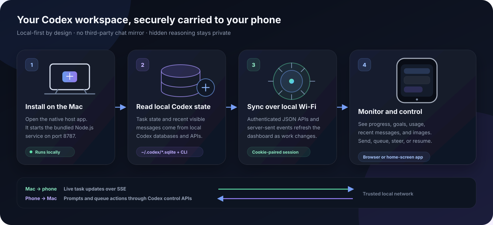

# Codex Local Hub — Mobile Dashboard for Codex · Codex 随身工作台

**Monitor and control long-running ChatGPT Codex tasks from your phone—without staying glued to your Mac.**

[](LICENSE)
[](https://github.com/brandonwang001/codex-local-hub/actions/workflows/ci.yml)


[简体中文](README.zh-CN.md) · English

<p align="center">
  
</p>

Codex Local Hub is an open-source **Codex mobile dashboard, task monitor, and phone remote control for macOS**. It turns a Mac running Codex into a private, phone-friendly task console on your local network. Scan the QR code in the macOS app to monitor task progress, review recent messages and visual deliveries, manage queued prompts, and continue a task without exposing your conversations to a third-party service.

中文用户可以把它理解为“**Codex 随身工作台**”：用手机查看和控制 Mac 上 ChatGPT/Codex 正在运行的任务，不用一直守着电脑。

> Codex Local Hub is an independent open-source project and is not affiliated with or endorsed by OpenAI.

## Stop babysitting long Codex tasks

Start a long Codex task, then leave your desk. From bed, the couch, the bathroom, or another room, you can open your phone to answer the questions that matter:

- Is the task still running, queued, paused, or finished?
- What did Codex just say, and does it need a reply?
- Is the screenshot or visual result ready to review?

Your Mac keeps doing the work while you keep living your life.

## See it in action

### 1. Start the host on your Mac

<p align="center">
  
</p>
<p align="center"><strong>Mac host app</strong> — start the local service, scan the LAN URL, and open the dashboard</p>

### 2. See every task at a glance

<p align="center">
  
</p>
<p align="center"><strong>Workspace home</strong> — usage, running work, queued tasks, and completed work stay visible together</p>

### 3. Open a task and continue the conversation

<p align="center">
  
</p>
<p align="center"><strong>Task conversation</strong> — review the latest visible messages, inspect the goal and queue, then send the next prompt</p>

### 4. Use the same flow on your phone

<table>
  <tr>
    <td width="50%"></td>
    <td width="50%"></td>
  </tr>
  <tr>
    <td align="center"><strong>Phone home</strong> — choose a task from the compact dashboard</td>
    <td align="center"><strong>Phone conversation</strong> — monitor progress and send the next prompt with one hand</td>
  </tr>
</table>

These are real product-interface screenshots with sanitized demo data. The working QR code and private LAN address in the host screenshot were replaced with a non-scannable placeholder and example address; no private task content is included.

## Install with one message to Codex

You do not need to begin with Terminal commands. Copy the message below into a Codex task on the Mac you want to use as the host:

```text
Use $skill-installer to install the setup skill from https://github.com/brandonwang001/codex-local-hub/tree/main/.agents/skills/setup-codex-local-hub. After installation, read the installed SKILL.md and carry it out in this task: install or update Codex Local Hub on this Mac, install its image-delivery skill, launch the app, and verify local phone access. Prefer the latest stable release; if no suitable release exists, build it from source. Continue autonomously unless an action genuinely requires me, then finish with the app location, access method, and verification results.
```

This one message asks Codex to install the reusable [`setup-codex-local-hub`](.agents/skills/setup-codex-local-hub) skill and immediately complete the setup. The skill keeps Gatekeeper enabled, preserves existing files, runs the test suite, verifies the application, installs the companion image-delivery skill, and stops instead of exposing the service to the public internet.

If the source repository already exists on the Mac, use this shorter follow-up; the same skill will preserve changes and choose an in-place source upgrade or a clean fallback checkout:

```text
Use $setup-codex-local-hub to update my existing Codex Local Hub source checkout and installed app. Fast-forward only if the checkout is clean; preserve every local change, run the full test suite, build the self-contained universal app, back up the installed version, replace it, relaunch it, and verify phone access. Do not ask me to download an installer manually.
```

If Codex reports that the selected model is at capacity, wait while the task is still working. If it stops, choose another available model and send this in the same task:

```text
Continue with $setup-codex-local-hub from the last verified setup stage. Reuse the existing checkpoint and files; do not restart completed work. Finish installation, launch, and phone-access verification.
```

## How it works



1. **Install the host app.** The native macOS wrapper starts its bundled Node.js service on the Mac and shows a QR code containing the plain phone address.
2. **Read local Codex data.** The service reads task, project, queue, goal, usage, and recent visible-message state from the local `~/.codex` databases. It uses the Codex CLI and app-server control channel for resume, queue, and steer actions; it does not scrape the ChatGPT web interface.
3. **Synchronize on the LAN.** Scanning the QR code opens the dashboard directly. JSON endpoints provide current state, while server-sent events refresh it when work changes.
4. **Control work from the phone.** Prompts and queue actions travel back to the Mac, where they are delivered to the selected Codex task. The service keeps only a small recent view for monitoring instead of building a second full chat archive.

The current release is local-network only. The data path stays between the Mac and devices on the same trusted Wi-Fi; no hosted Codex Local Hub relay is involved.

## Why Codex Local Hub?

- **Phone-first monitoring** — see running, queued, paused, failed, and completed tasks.
- **Two-way control** — send prompts, reorder or remove queued prompts, and steer an active task.
- **Interrupted-task recovery** — resume a paused task with one tap.
- **Visual delivery inbox** — review the latest screenshots and image results on your phone.
- **Usage visibility** — see current Codex usage and reset times.
- **Privacy by default** — task data stays on your Mac and local network.
- **Focused history** — only the latest 20 visible messages and images are presented; hidden reasoning is never mirrored.
- **English and Simplified Chinese** — follows the device language on first launch, with a remembered manual switch in the header.
- **Installable mobile shortcut** — add the dashboard to an iPhone, iPad, or Android home screen.

## Built for these workflows

- Monitor long-running Codex coding tasks from the couch, another room, or a mobile device.
- Send the next prompt without returning to the Mac.
- Reorder queued prompts and steer urgent work into the active turn.
- Review screenshots and visual results before accepting a UI implementation.
- Keep Codex task history local instead of copying full conversations into a hosted dashboard.

## Enable the visual delivery skill

The **Delivery inbox** is built into Codex Local Hub. The one-message setup above installs the companion [`deliver-to-codex-local-hub`](.agents/skills/deliver-to-codex-local-hub) skill automatically. It teaches Codex how to validate an existing screenshot or image and stage it for the inbox. It uses the app's bundled Node.js, so it does not add a global runtime dependency. The source file is never moved or modified, and the inbox keeps only the latest 20 supported images.

Recommended installation: send this message in Codex (it is not a Terminal command):

```text
$skill-installer Install the skill from https://github.com/brandonwang001/codex-local-hub/tree/main/.agents/skills/deliver-to-codex-local-hub
```

If you cloned this repository, Codex can discover the repo-scoped skill automatically while working inside the repository. To install it manually for every project:

```bash
mkdir -p "$HOME/.agents/skills"
cp -R ".agents/skills/deliver-to-codex-local-hub" "$HOME/.agents/skills/"
```

Codex normally detects the new skill automatically; restart Codex if it does not appear. Then ask naturally, or invoke it explicitly:

```text
Use $deliver-to-codex-local-hub to send /absolute/path/to/screenshot.png to my phone as "Checkout result".
```

Keep Codex Local Hub running. The image appears in **Delivery inbox** on the next refresh. Supported formats are PNG, JPEG, WebP, and GIF, up to 20 MB. See the [official OpenAI skill documentation](https://learn.chatgpt.com/docs/build-skills) for how Codex discovers and invokes skills.

## Requirements

- macOS 15 or newer
- Node.js 22.22.2 or newer when building from source; the installed app bundles isolated Apple silicon and Intel runtimes
- Codex available through the ChatGPT desktop installation and local `~/.codex` state
- A phone and Mac connected to the same trusted Wi-Fi network

## Install

For most users, the **Install with one message to Codex** flow near the top of this README is the recommended path.

The first public notarized DMG is being prepared. Until it is available in GitHub Releases, the one-message setup builds from source with the user's existing Node.js 22.22.2+. It checks the version but never installs, upgrades, relinks, or changes that Node environment. The built app contains its own Apple silicon and Intel runtimes. See the [installation guide](docs/INSTALL.md) and [macOS compatibility matrix](docs/COMPATIBILITY.md).

The Mac app checks the latest stable GitHub Release at most once per day—no Codex Local Hub update server is required. A strictly newer version normally installs as a small, checksum-verified core hot update containing only the local service and web UI. The app switches versions atomically, restarts the service, and rolls back automatically if the new core cannot start. A full universal DMG is used only when the native Mac host must change. Drafts, prereleases, equal versions, and downgrades are ignored. **Check for updates** also supports a manual refresh.

If you want Codex to perform a full install or host upgrade without manually downloading anything, use the same setup skill shown above. It prefers a notarized release package and can also safely fast-forward an existing clean source checkout, run all tests, rebuild, back up the installed app, replace it, and verify phone access. Local source changes are never overwritten.

For development:

```bash
git clone https://github.com/brandonwang001/codex-local-hub.git
cd codex-local-hub
npm install
BUNDLE_NODE=1 npm run build:mac
open "dist/Codex Local Hub.app"
```

The build uses the current Node.js only for repository-local install, tests, and compilation. It does not install global packages or change the developer's Node configuration; the resulting app runs with its own bundled Node.js.

Then:

1. Keep the Mac and phone on the same Wi-Fi.
2. Open **Codex Local Hub** on the Mac.
3. Scan the QR code with the phone camera.
4. Optional: in Safari, choose **Share → Add to Home Screen**.

Use `npm start` for the browser-only development server. Use `npm run package:mac` to create a self-contained universal DMG.

The default port is `8787`. Environment overrides include `PORT`, `HOST`, `BRIDGE_REQUIRE_PAIRING`, `BRIDGE_TOKEN`, `CODEX_BIN`, `CODEX_TASK_DESK_INBOX`, and `CODEX_TASK_DESK_OUTBOX`.

## Security and privacy

- The dashboard is designed for a **trusted local network**.
- The default QR code contains the plain LAN URL and opens the dashboard directly—there is no token for users to copy or manage.
- Anyone who can reach the Mac on that trusted LAN can use the dashboard, including its control actions. Use it only on a network you trust.
- Advanced browser-only deployments can opt into the legacy cookie gate with `BRIDGE_REQUIRE_PAIRING=1`; a random 256-bit secret is then stored with owner-only permissions.
- Raw chain-of-thought, hidden reasoning, and complete conversation archives are not exposed.
- Do **not** forward port `8787` directly to the public internet.

See [SECURITY.md](SECURITY.md) before deploying or modifying the network boundary.

## Reliability

- Server-side state is read incrementally and cached only in memory.
- The macOS wrapper automatically restarts the local service after unexpected exits with bounded backoff.
- The UI keeps existing thumbnails during network jitter to prevent flashing.
- Idle and interrupted tasks are started through Codex resume rather than silently remaining queued.
- Queue mutations use revision checks to prevent conflicting edits.

## Tests

```bash
npm test
npm run test:coverage
```

The coverage command enforces 100% line, branch, and function coverage for the core synchronization, control, delivery, usage, HTTP, and frontend modules.

## Current scope

Codex Local Hub currently operates on the local network. Screen locking does not stop it, but sleep, shutdown, quitting the app, or leaving the LAN makes it unavailable. A TLS-secured public relay is planned; direct port exposure is intentionally unsupported.

## FAQ

### Is this an official OpenAI or Codex product?

No. Codex Local Hub is an independent open-source companion for local Codex workflows.

### Does it expose chain-of-thought or copy my full chat history?

No. It presents recent visible messages, task state, goals, queue information, usage, and visual deliveries. Hidden reasoning is not mirrored.

### Can I use it outside my home network?

Not yet. The current release is LAN-only. Do not expose port `8787` directly to the internet; the roadmap includes an authenticated TLS relay.

### Does locking the Mac stop synchronization?

No. Locking the screen is supported. Sleep, shutdown, or quitting Codex Local Hub will stop access until the Mac is available again.

## Roadmap

- Signed remote relay for away-from-home access
- Push notifications for completion, failure, and input requests
- Launch-at-login and richer health diagnostics
- Voice prompts and reusable prompt shortcuts
- Side-by-side image comparison and delivery annotations
- Linux host package for relay and headless installations

## Contributing

Issues and pull requests are welcome. Read [CONTRIBUTING.md](CONTRIBUTING.md) and the [Code of Conduct](CODE_OF_CONDUCT.md) first.

## License

[MIT](LICENSE)
