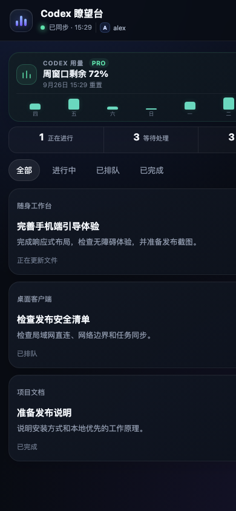

# Codex Local Hub · Codex 随身工作台

[English](README.md) · 简体中文

**把 Mac 上的 Codex 任务变成一个可在手机上查看和控制的本地工作台。**

[](LICENSE)
[](https://github.com/brandonwang001/codex-local-hub/actions/workflows/ci.yml)


Codex Local Hub 是一个开源的 **Codex 手机控制台、任务监控器和 macOS 远程助手**。打开 Mac 客户端，扫描二维码，即可在同一局域网内查看任务进度、最近对话、长程目标和图片交付结果，并从手机继续发送提示词。

> 本项目是独立开源项目，与 OpenAI 没有隶属或官方背书关系。

## 运行效果

<table>
  <tr>
    <td width="78%"></td>
    <td width="22%"></td>
  </tr>
  <tr>
    <td align="center"><strong>电脑端工作区</strong>：任务列表与对话进度同时可见</td>
    <td align="center"><strong>手机端工作台</strong>：适合单手操作的紧凑布局</td>
  </tr>
</table>

以上为真实产品界面截图，使用的是脱敏示例数据，不包含私人任务内容、配对密钥或可用二维码。

## 能做什么

- 同步 Codex 任务、项目、进度与最近 20 条可见消息
- 从手机发送提示词，空闲任务直接启动，忙碌任务进入队列
- 调整队列优先级、删除任务、将某条消息立即 steer 到当前回合
- 一键恢复被中断或暂停的任务
- 查看长程 goal、执行时长和当前状态
- 查看 Codex 用量与重置时间
- 在交付信箱中查看最近 20 张截图或图片结果
- 首次打开跟随设备语言，支持中英文手动切换并记住选择，也可添加到手机主屏幕
- 不同步隐藏思考过程，不复制保存完整聊天历史

## 适合哪些场景

- 在沙发、床上或另一个房间监控长时间运行的 Codex 编程任务
- 不回到 Mac 前也能发送下一条提示词
- 手动调整任务队列优先级，把紧急消息 steer 到当前回合
- 在手机上检查截图和视觉交付结果，再决定是否验收
- 保持本地优先，不把完整对话复制到第三方托管面板

## 工作原理


1. **安装宿主程序。** macOS 原生外壳会在 Mac 上启动内置的 Node.js 服务，并显示手机访问地址和一次性配对二维码。
2. **读取 Codex 本地数据。** 服务从本机 `~/.codex` 数据库读取任务、项目、队列、目标、用量和最近可见消息；恢复任务、管理队列和 steer 操作通过 Codex 命令行与 app-server 控制通道完成，不会抓取 ChatGPT 网页界面。
3. **在局域网内同步。** 手机扫码配对后获得 HttpOnly 会话 Cookie。经过认证的接口提供当前状态，实时事件会在任务变化时刷新手机页面。
4. **从手机反向控制。** 新提示词和队列操作会回传到 Mac，再交给指定的 Codex 任务。系统只保留用于监控的少量最近内容，不会建立第二份完整聊天档案。

当前版本只在局域网内工作，数据只在 Mac 与同一可信 Wi-Fi 下的已配对设备之间传输，不经过 Codex Local Hub 的公网中继。

## 启用图片交付 Skill

**交付信箱**本身已经内置在 Codex Local Hub 中。可选的 [`deliver-to-codex-local-hub`](.agents/skills/deliver-to-codex-local-hub) Skill 会告诉 Codex 如何检查现有截图或图片，并把它安全地放入交付通道。原图不会被移动或修改，信箱只保留最近 20 张受支持的图片。

推荐安装方式：在 Codex 对话中发送下面这句话，注意这不是终端命令：

```text
$skill-installer 请从 https://github.com/brandonwang001/codex-local-hub/tree/main/.agents/skills/deliver-to-codex-local-hub 安装这个 Skill
```

如果已经克隆本仓库，在仓库目录内使用 Codex 时会自动发现仓库级 Skill。也可以手动安装到个人目录，让它在所有项目中可用：

```bash
mkdir -p "$HOME/.agents/skills"
cp -R ".agents/skills/deliver-to-codex-local-hub" "$HOME/.agents/skills/"
```

Codex 通常会自动发现新 Skill；如果没有出现，请重启 Codex。安装后可以直接描述需求，也可以明确调用：

```text
使用 $deliver-to-codex-local-hub，把 /图片的绝对路径/效果截图.png 以“结账页效果”的名称发送到我的手机。
```

使用时请保持 Codex Local Hub 运行，图片会在下一次刷新时出现在**交付信箱**。支持 PNG、JPEG、WebP 和 GIF，单张不超过 20 MB。Codex 如何发现和调用 Skill，可参考 [OpenAI 官方 Skill 文档](https://learn.chatgpt.com/docs/build-skills)。

## 安装

首个经过 Apple 公证的公开 DMG 正在准备中。在 GitHub Releases 提供之前，请先按照下面的开发者步骤从源码构建。未来发布包会内置 Apple Silicon 与 Intel 版本的 Node.js，普通用户不需要单独安装 Node 或打开终端。详细说明见[安装指南](docs/INSTALL.md)和[兼容性说明](docs/COMPATIBILITY.md)。

开发者构建：

环境要求：macOS 15+、Node.js 22+、本机已安装并使用 Codex。

```bash
git clone https://github.com/brandonwang001/codex-local-hub.git
cd codex-local-hub
npm install
npm run build:mac
open "dist/Codex Local Hub.app"
```

然后让手机与 Mac 连接同一个 Wi-Fi，使用相机扫描 Mac 程序里的二维码即可。二维码只用于首次安全配对，打开后的网址不会显示 Token。

浏览器开发模式：

```bash
npm start
```

生成包含运行时的 Universal DMG：

```bash
npm run package:mac
```

## 局域网模式说明

- 锁定 Mac 屏幕不影响运行。
- Mac 休眠、关机或退出程序后，手机将无法连接。
- 当前版本只支持同一局域网。
- 不要将 `8787` 端口直接映射到公网。
- 后续远程模式将通过带 TLS 和设备认证的中继实现。

## 添加到手机桌面

在 iPhone 或 iPad 上使用 Safari 打开，然后选择 **分享 → 添加到主屏幕**。Android 可在 Chrome 菜单中选择“添加到主屏幕”或“安装应用”。

## 隐私与安全

- 新设备必须通过 Mac 上的二维码配对。
- API 使用 HttpOnly、SameSite Cookie。
- 会话密钥以仅当前用户可读的权限保存在 Mac。
- 不同步隐藏推理和工具细节。
- 仅展示最近消息和交付图片，服务端不建立完整聊天副本。

详细信息见 [SECURITY.md](SECURITY.md)。

## 测试

```bash
npm test
npm run test:coverage
```

覆盖率命令对核心模块执行 100% 行、分支与函数覆盖率门槛。

## 路线图

- 公网安全中继与远程模式
- 完成、失败、需要回复时的手机通知
- 登录时自动启动与更完整的健康检查
- 语音提示词和常用提示词快捷操作
- 图片对比与标注反馈
- Linux 中继与无界面运行包

## 常见问题

### 这是 OpenAI 或 Codex 官方项目吗？

不是。这是一个面向本地 Codex 工作流的独立开源项目。

### 会同步隐藏思考过程或完整聊天记录吗？

不会。系统只展示最近的可见消息、任务状态、目标、队列、用量和图片交付，不会镜像隐藏推理。

### 可以在外网使用吗？

暂时不可以。当前版本仅支持局域网，请勿把 `8787` 端口直接暴露到公网。路线图中包含带身份验证和 TLS 的远程中继。

### 锁定 Mac 后还可以访问吗？

可以。锁屏不会停止同步；Mac 休眠、关机或退出 Codex Local Hub 后会暂时无法访问。

欢迎阅读 [贡献指南](CONTRIBUTING.md) 并提交 Issue 或 Pull Request。

## License

[MIT](LICENSE)
