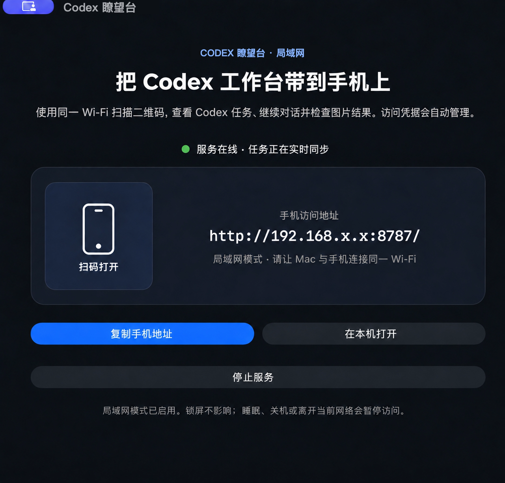

# Codex 瞭望台 · 用手机查看和控制 Codex 的随身工作台

## 复制到 Codex，立即安装

```text
使用 $skill-installer 安装 https://github.com/makorise/codex-local-hub/tree/main/.agents/skills/setup-codex-local-hub，然后在当前任务中使用 $setup-codex-local-hub：安装或更新 Codex Local Hub、安装图片交付 Skill、启动程序并验证手机访问。优先使用最新正式版，否则从源码构建；保护已有文件，不要修改我的全局 Node.js 环境。
```

[**访问产品官网 →**](https://makorise.github.io/codex-local-hub/) · [English](README.md)

**不用一直守着电脑，也能从手机查看 ChatGPT/Codex 做到哪、是否需要回复。**

<p align="center">
  
</p>

[](LICENSE)
[](https://github.com/makorise/codex-local-hub/actions/workflows/ci.yml)


Codex 瞭望台是一个开源的 **Codex 手机控制台、任务监控器和 macOS 远程助手**。打开 Mac 客户端，扫描二维码，即可在同一局域网内查看 ChatGPT 桌面版里的 Codex 任务进度、最近对话、长程目标和图片交付结果，并从手机继续发送提示词。为保证已有安装可以安全升级，当前下载包仍保留 Codex Local Hub 应用名称。

> 本项目是独立开源项目，与 OpenAI 没有隶属或官方背书关系。

## 不用一直守着电脑

启动一个耗时较长的 Codex 任务后，你可以离开工位。躺在床上、窝在沙发、去上厕所或走到另一个房间时，拿起手机就能知道：

- 任务还在运行、排队、暂停，还是已经完成？
- Codex 刚刚回复了什么，是否正在等你补充信息？
- 截图或视觉结果是否已经生成，可以直接验收？

Mac 继续工作，你继续生活。

## 运行效果

### 1. 在 Mac 上启动服务

<p align="center">
  
</p>
<p align="center"><strong>Mac 宿主程序</strong>：启动本地服务、扫描局域网网址并打开工作台</p>

### 2. 在主页总览全部任务

<p align="center">
  
</p>
<p align="center"><strong>工作台主页</strong>：用量、正在进行、等待处理和已完成任务一目了然</p>

### 3. 进入具体任务并继续对话

<p align="center">
  
</p>
<p align="center"><strong>任务对话</strong>：查看最近可见消息、目标和队列，再发送下一条提示词</p>

### 4. 在手机上完成同样的操作

<table>
  <tr>
    <td width="50%"></td>
    <td width="50%"></td>
  </tr>
  <tr>
    <td align="center"><strong>手机主页</strong>：从紧凑的任务面板中选择任务</td>
    <td align="center"><strong>手机对话</strong>：单手查看进度并发送下一条提示词</td>
  </tr>
</table>

以上为真实产品界面截图，使用的是脱敏示例数据。宿主程序截图中的有效二维码和私人局域网地址已经替换为不可扫描的占位图与示例地址，不包含私人任务内容。

## 安装方式说明

README 最上方的命令会安装可复用的 [`setup-codex-local-hub`](.agents/skills/setup-codex-local-hub) Skill，并立即完成后续工作。这个 Skill 会保持 Gatekeeper 开启、保护已有文件、运行完整测试、验证应用、安装图片交付 Skill；它不会擅自把本地服务暴露到公网。

如果 Mac 上已经有源码仓库，可以继续把下面这句话发给 Codex。同一个 Skill 会保护本地修改，并在原地源码升级与全新干净检出之间安全选择：

```text
使用 $setup-codex-local-hub 更新我现有的 Codex Local Hub 源码仓库和已安装程序。只有仓库完全干净时才允许快进；保留全部本地修改，运行完整测试，构建内置双架构运行时的通用程序，备份旧版本后完成替换、重新启动并验证手机访问。不要让我手动下载安装包。
```

如果看到“所选模型容量已满”，但任务仍显示正在工作，可以先让它继续。如果任务已经停止，请切换到另一个可用模型，并在同一个任务中发送：

```text
继续使用 $setup-codex-local-hub，从上一次已经验证成功的安装阶段接着执行。复用已有检查点和文件，不要重做已经完成的工作；继续完成安装、启动和手机访问验证。
```

## 工作原理


1. **安装宿主程序。** macOS 原生外壳会在 Mac 上启动内置的 Node.js 服务，并显示包含普通手机访问地址的二维码。
2. **读取 Codex 本地数据。** 服务从本机 `~/.codex` 数据库读取任务、项目、队列、目标、用量和最近可见消息；恢复任务、管理队列和 steer 操作通过 Codex 命令行与 app-server 控制通道完成，不会抓取 ChatGPT 网页界面。
3. **在局域网内同步。** 手机扫码后直接打开工作台。JSON 接口提供当前状态，实时事件会在任务变化时刷新手机页面。
4. **从手机反向控制。** 新提示词和队列操作会回传到 Mac，再交给指定的 Codex 任务。系统只保留用于监控的少量最近内容，不会建立第二份完整聊天档案。

当前版本只在局域网内工作，数据只在 Mac 与同一可信 Wi-Fi 下的设备之间传输，不经过 Codex Local Hub 的公网中继。

## 能做什么

- 同步 Codex 任务、项目、进度与最近 20 条可见消息
- 从手机发送提示词，空闲任务直接启动，忙碌任务进入队列
- 调整队列优先级、删除任务、将某条消息立即 steer 到当前回合
- 一键恢复被中断或暂停的任务
- 查看长程 goal、执行时长和当前状态
- 查看 Codex 用量与重置时间
- 在交付信箱中查看最近 20 张截图或图片结果
- 首次打开跟随设备语言，支持中英文手动切换并记住选择，也可添加到手机主屏幕
- 不同步隐藏思考过程，不复制保存完整聊天历史

## 适合哪些场景

- 在沙发、床上或另一个房间监控长时间运行的 Codex 编程任务
- 不回到 Mac 前也能发送下一条提示词
- 手动调整任务队列优先级，把紧急消息 steer 到当前回合
- 在手机上检查截图和视觉交付结果，再决定是否验收
- 保持本地优先，不把完整对话复制到第三方托管面板

## 启用图片交付 Skill

**交付信箱**本身已经内置在 Codex Local Hub 中。使用上面的一句话安装方式时，系统会自动安装配套的 [`deliver-to-codex-local-hub`](.agents/skills/deliver-to-codex-local-hub) Skill。它会告诉 Codex 如何检查现有截图或图片，并把它安全地放入交付通道。Skill 使用 App 内置的 Node.js，不会增加全局运行时依赖。原图不会被移动或修改，信箱只保留最近 20 张受支持的图片；看完后可用紧凑的“清空”按钮删除信箱副本，不影响原图。

推荐安装方式：在 Codex 对话中发送下面这句话，注意这不是终端命令：

```text
$skill-installer 请从 https://github.com/makorise/codex-local-hub/tree/main/.agents/skills/deliver-to-codex-local-hub 安装这个 Skill
```

如果已经克隆本仓库，在仓库目录内使用 Codex 时会自动发现仓库级 Skill。也可以手动安装到个人目录，让它在所有项目中可用：

```bash
mkdir -p "$HOME/.agents/skills"
cp -R ".agents/skills/deliver-to-codex-local-hub" "$HOME/.agents/skills/"
```

Codex 通常会自动发现新 Skill；如果没有出现，请重启 Codex。安装后可以直接描述需求，也可以明确调用：

```text
使用 $deliver-to-codex-local-hub，把 /图片的绝对路径/效果截图.png 以“结账页效果”的名称发送到我的手机。
```

使用时请保持 Codex Local Hub 运行，图片会在下一次刷新时出现在**交付信箱**。支持 PNG、JPEG、WebP 和 GIF，单张不超过 20 MB。Codex 如何发现和调用 Skill，可参考 [OpenAI 官方 Skill 文档](https://learn.chatgpt.com/docs/build-skills)。

## 安装

对大多数用户，推荐直接使用 README 开头的“复制一句话，让 Codex 完成安装”。

GitHub 正式版现已为已有安装提供经过 SHA-256 校验的核心热升级。Release 中附带的通用 DMG 预览目前尚未经过 Apple 公证，因此新用户仍建议使用“一句话安装”：它会使用电脑上已有的 Node.js 22.22.2+ 从源码构建，不会安装、升级、重连或修改原有 Node 环境；编译出的 App 会内置 Apple Silicon 与 Intel 版 Node.js。详细说明见[安装指南](docs/INSTALL.md)和[兼容性说明](docs/COMPATIBILITY.md)。

Mac 程序每天最多检查一次最新的 GitHub 正式版，不需要 Codex Local Hub 自建更新服务器。只有远端语义版本严格高于当前版本时才会提示。普通更新只下载经过 SHA-256 校验的核心包（本地服务与网页），原子切换后重启服务；新核心无法启动时会自动回退。只有 Swift 宿主必须变化时才使用完整通用 DMG。草稿、预发布版、相同版本和降级版本都会被忽略，也可以随时点击“检查更新”手动检查。

如果希望 Codex 在不需要用户手动下载的情况下完成全新安装或宿主升级，继续使用 README 开头的安装 Skill 即可。它会优先选择经过公证的安装包；已有干净源码仓库时，也可以安全地快进源码、运行全部测试、重新构建、备份旧程序、完成替换并验证手机访问，绝不会覆盖本地源码修改。

开发者构建：

环境要求：macOS 15+、Node.js 22.22.2+、本机已安装并使用 Codex。Node 只用于源码编译，安装后的程序会使用自己内置的运行时。

```bash
git clone https://github.com/makorise/codex-local-hub.git
cd codex-local-hub
npm install
BUNDLE_NODE=1 npm run build:mac
open "dist/Codex Local Hub.app"
```

编译过程只在仓库内安装依赖和生成产物，不安装全局 npm 包，也不修改 Shell、包管理器、普通 `node` 命令或开发者原有项目。生成的 App 运行时使用自己的内置 Node.js。

然后让手机与 Mac 连接同一个可信 Wi-Fi，使用相机扫描 Mac 程序里的二维码即可。二维码内容就是普通局域网网址，扫描后直接用浏览器打开，不需要输入或管理 Token。

浏览器开发模式：

```bash
npm start
```

生成包含运行时的 Universal DMG：

```bash
npm run package:mac
```

## 局域网模式说明

- 锁定 Mac 屏幕不影响运行。
- Mac 休眠、关机或退出程序后，手机将无法连接。
- 当前版本只支持同一局域网。
- 不要将 `8787` 端口直接映射到公网。
- 后续远程模式将通过带 TLS 和设备认证的中继实现。

## 添加到手机桌面

在 iPhone 或 iPad 上使用 Safari 打开，然后选择 **分享 → 添加到主屏幕**。Android 可在 Chrome 菜单中选择“添加到主屏幕”或“安装应用”。

## 隐私与安全

- 默认二维码只包含普通局域网网址，扫描后直接打开，不需要复制或管理 Token。
- 同一可信局域网内能够访问这台 Mac 的设备，也能够使用工作台及其中的控制操作，因此只应在可信网络中运行。
- 浏览器高级部署可以通过 `BRIDGE_REQUIRE_PAIRING=1` 启用旧版 Cookie 保护；此时会话密钥以仅当前用户可读的权限保存在 Mac。
- 不同步隐藏推理和工具细节。
- 仅展示最近消息和交付图片，服务端不建立完整聊天副本。

详细信息见 [SECURITY.md](SECURITY.md)。

## 测试

```bash
npm test
npm run test:coverage
```

覆盖率命令对核心模块执行 100% 行、分支与函数覆盖率门槛。

## 路线图

- 公网安全中继与远程模式
- 完成、失败、需要回复时的手机通知
- 登录时自动启动与更完整的健康检查
- 语音提示词和常用提示词快捷操作
- 图片对比与标注反馈
- Linux 中继与无界面运行包

## 常见问题

### 这是 OpenAI 或 Codex 官方项目吗？

不是。这是一个面向本地 Codex 工作流的独立开源项目。

### 会同步隐藏思考过程或完整聊天记录吗？

不会。系统只展示最近的可见消息、任务状态、目标、队列、用量和图片交付，不会镜像隐藏推理。

### 可以在外网使用吗？

暂时不可以。当前版本仅支持局域网，请勿把 `8787` 端口直接暴露到公网。路线图中包含带身份验证和 TLS 的远程中继。

### 锁定 Mac 后还可以访问吗？

可以。锁屏不会停止同步；Mac 休眠、关机或退出 Codex Local Hub 后会暂时无法访问。

欢迎阅读 [贡献指南](CONTRIBUTING.md) 并提交 Issue 或 Pull Request。

## License

[MIT](LICENSE)
